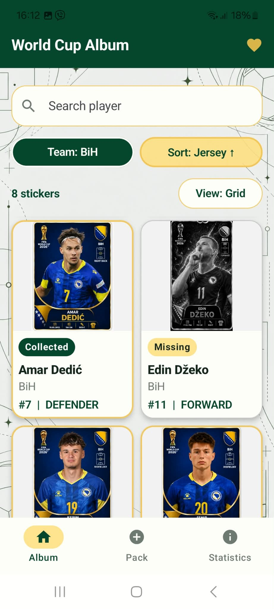
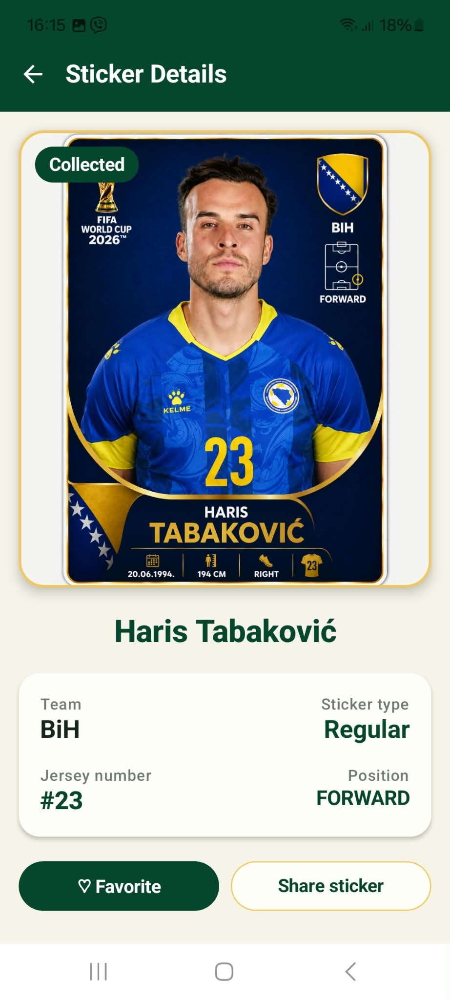
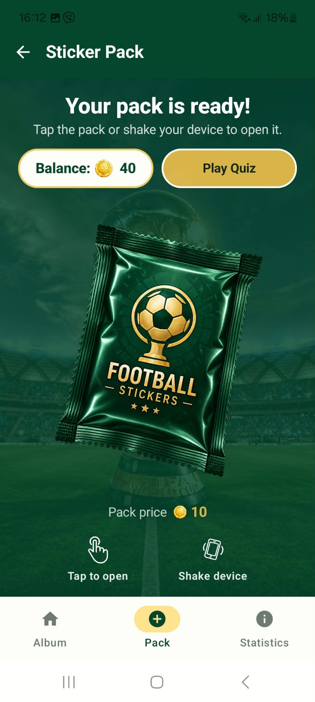
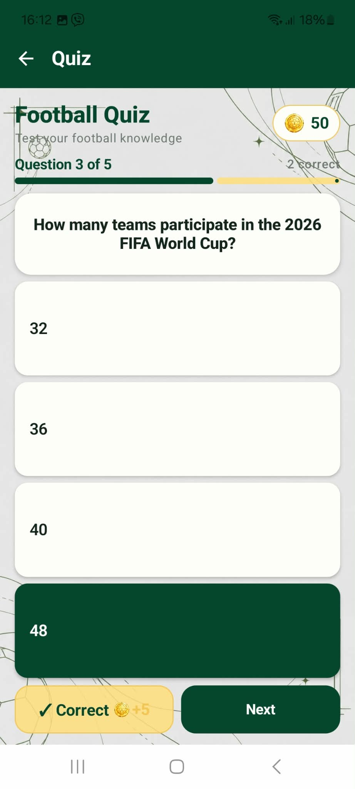
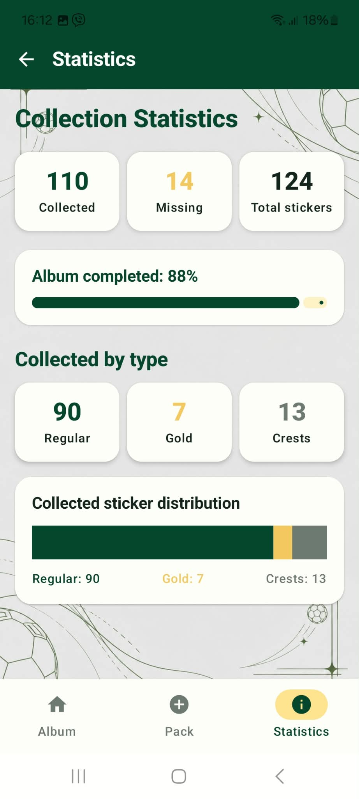

# Digital Sticker Album

An Android application for collecting, viewing, and managing a digital football sticker collection for the 2026 World Cup.

This project was developed as an individual university project for the **Mobile Application Development** course at the **University of Sarajevo – Faculty of Science**.

## Features

- Browse a digital football sticker collection
- Search stickers by player name
- Filter stickers by team
- Sort stickers by jersey number
- Switch between different collection views
- View detailed information about individual stickers
- Mark stickers as favorites
- Share sticker information through other Android applications
- Open sticker packs and add new stickers to the collection
- Open packs either by tapping the screen or shaking the device
- Earn and spend in-app coins
- Play a football quiz to earn additional coins
- View collection statistics and completion progress
- Track collected and missing stickers
- Offline access through local data persistence and caching

## Technologies

- **Kotlin**
- **Android**
- **Jetpack Compose**
- **MVVM architecture**
- **Retrofit**
- **Room Database**
- **Kotlin Coroutines**
- **Flow**
- **Navigation for Compose**
- **DataStore**
- **Material 3**
- **Android Sensors / Accelerometer**

## Architecture

The application follows the **MVVM (Model-View-ViewModel)** architecture.

The project separates responsibilities between:

- **UI layer** – screens and components built with Jetpack Compose
- **ViewModels** – UI state and application logic
- **Repository layer** – central data access layer
- **Retrofit** – communication with the external REST API
- **Room** – local persistence and offline data access

This structure helps keep the user interface separated from data handling and application logic.

## API and Offline Support

The application integrates an external REST API provided for the university project.

Sticker data retrieved from the API is stored locally using **Room**, allowing previously synchronized data to remain available when the device is offline.

> Note: Some online functionality depends on the availability of the external course API.

## Additional Functionality

The application includes several features beyond basic data display and CRUD functionality:

- **Shake-to-open sticker packs** using the device accelerometer
- **Quiz and coin system**
- **Collection statistics and visual progress tracking**
- **Favorites**
- **Sharing functionality**
- **Filtering and sorting**
- **Offline caching**

## Screenshots

| Album | Sticker Details | Sticker Pack |
|---|---|---|
|  |  |  |

| Quiz | Statistics |
|---|---|
|  |  |

## Project Structure

```text
app/src/main/java/com/example/stickeralbum/
├── data/
├── model/
├── navigation/
├── network/
└── ui/
